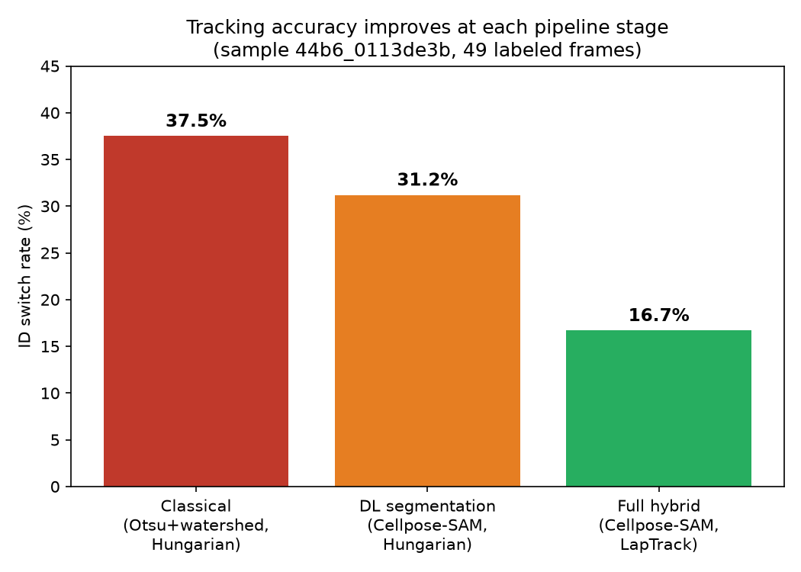
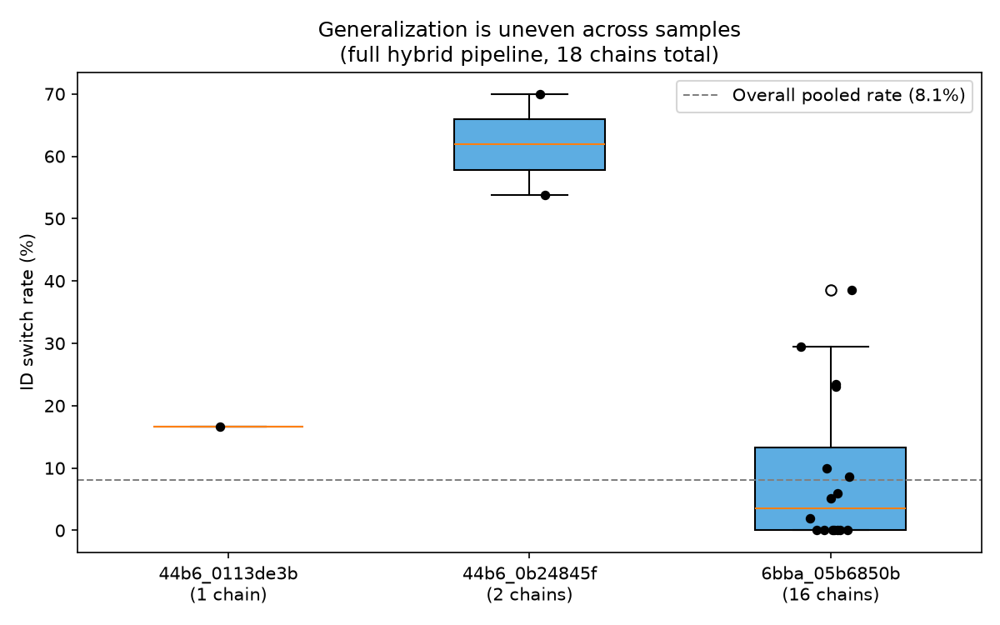

# celltrack3d

**3D + time cell detection and tracking in zebrafish embryo light-sheet microscopy**


*A single ground-truth-labeled cell tracked across 49 frames using the full hybrid pipeline (Cellpose-SAM segmentation + LapTrack linking). Cyan dots are all detections in that frame; the red trail is the tracked cell's path.*

## What this is

Cells in a developing embryo divide, move, and rearrange in three dimensions over time. Turning a raw light-sheet microscopy recording into "which cell went where, and which cell it came from" is a core bottleneck in developmental biology. This project builds a full pipeline for it — from raw volumetric time-lapse data to evaluated, visualized cell tracks — using real data from an open Kaggle research competition: [Biohub — Cell Tracking During Development](https://www.kaggle.com/competitions/biohub-cell-tracking-during-development), released by the Chan Zuckerberg Biohub (Loïc Royer's group), which also produced [Ultrack](https://github.com/royerlab/ultrack), a current state-of-the-art tool in this space.

The approach is deliberately hybrid: build a classical computer-vision baseline first, then layer on a deep-learning upgrade, and **measure** the improvement at each stage rather than assume it.

## Pipeline

```
Raw volumes (Zarr v3, 4D)                        Ground-truth tracks (.geff graph)
        │                                                      │
        ▼                                                      │
 preprocessing (denoise, normalize)                            │
        │                                                      │
        ▼                                                      │
 segmentation: classical (Otsu+watershed)                      │
             → DL (Cellpose-SAM, 3D-aware)                     │
        │                                                      │
        ▼                                                      │
 tracking: classical (Hungarian, physical-distance gated)      │
         → hybrid (LapTrack, proper LAP with birth/death)      │
        │                                                      │
        ▼                                                      ▼
              evaluation: ID switch rate vs. ground truth
                        │
                        ▼
              visualization + this report
```

## Results

Each pipeline stage was measured against the same ground-truth cell (49 labeled frames, sample `44b6_0113de3b`) before moving to the next stage — an ablation, not a single end-to-end number.



| Pipeline | Segmentation | Linking | ID switch rate |
|---|---|---|---|
| Classical baseline | Otsu + watershed | Hungarian assignment, physical-distance gated | 37.5% |
| DL segmentation only | Cellpose-SAM | Hungarian assignment, physical-distance gated | 31.2% |
| **Full hybrid** | Cellpose-SAM | **LapTrack** (proper LAP with birth/death) | **16.7%** |

Two findings worth calling out specifically, not just the headline number:

- **Segmentation quality alone bought a modest gain** (37.5% → 31.2%). The bigger jump came from switching to a proper linear-assignment-problem tracker that allows a detection to go unmatched at a fixed cost, instead of forcing every detection into a same-size bipartite match the way a naive Hungarian-assignment implementation does. In dense tissue, that structural fix mattered more than segmentation quality or any explicit motion model.
- **Voxel anisotropy had to be handled explicitly.** This dataset's z-spacing is ~4x coarser than xy (1.625µm vs. 0.40625µm) — every distance-based step (watershed seed spacing, linking cost, Cellpose's own 3D mode) needed that ratio passed in explicitly, or 3D distances would have been badly wrong.

### Does it generalize? Only partially — and that's worth showing, not hiding.



Validating the same full-hybrid pipeline on 3 samples (18 labeled chains, 1044 frame-transitions total) shows the 16.7% result does **not** hold uniformly. One sample (`44b6_0b24845f` — the same embryo as the primary result, just a different field of view) performed far worse (53.8%–70.0%), while a third sample mostly did *better* (many chains at 0-10%).

A methodical root-cause investigation on the failing sample tested three specific hypotheses against direct evidence:
1. **Merged blobs** (segmentation fusing touching cells) — mostly ruled out.
2. **Simple dropout** (cell not detected at all) — partially true, but didn't explain persistent 10–30µm position offsets in frames where *something* was detected.
3. **Low intensity** (dim cells get missed) — not supported; the cell's brightness sat consistently between the median and 95th percentile.

**Honest conclusion:** the failure looks like local competition among several visually similar, moderately-bright neighboring cells, not one single clean mechanism. The pipeline's reliability is not uniform across samples, and that's a genuine limitation, not a bug to paper over.

## Repository structure

```
celltrack3d/
│── data/
│   ├── raw/            # untouched kagglehub download
│   ├── processed/       # cached segmentation masks, cropped volumes
│   └── external/        # reference data for benchmarking
│── notebooks/            # exploratory notebooks
│── src/
│   ├── io/               # zarr + .geff loaders, kagglehub download
│   ├── preprocessing/     # denoising, normalization
│   ├── visualization/     # EDA, hero animation, summary charts
│   ├── segmentation/      # classical (watershed) + DL (Cellpose-SAM)
│   ├── tracking/          # classical (Hungarian) + hybrid (LapTrack)
│   ├── evaluation/        # ID-switch-rate scoring against ground truth
│   └── utils/             # voxel scale + other project constants
│── experiments/           # versioned run configs + metrics
│── models/                # trained/fine-tuned weights (gitignored)
│── reports/               # figures, GIFs, this README's assets
│── requirements.txt
└── README.md
```

## Setup

```bash
bash setup_repo.sh                       # scaffolds the structure above
cd celltrack3d
python -m venv .venv && source .venv/bin/activate
pip install -r requirements.txt

# Kaggle auth (pick one — see https://github.com/Kaggle/kagglehub#authenticate):
python -c "import kagglehub; kagglehub.login()"

python src/io/download.py                # downloads one sample pair for local dev
```

Heavy DL segmentation runs (Cellpose-SAM in 3D) are compute-intensive enough that they were run on a Kaggle Notebook (free GPU, data pre-mounted, no download needed) rather than locally — see `planning.md` for the full reasoning and the exact notebook scripts used.

## Tech stack

`numpy` · `pandas` · `matplotlib` · `scipy` · `scikit-image` · `zarr` (v3) · `geff` · `networkx` · `cellpose` (Cellpose-SAM) · `laptrack` · `kagglehub`

## Acknowledgments

- Data: [Biohub — Cell Tracking During Development](https://www.kaggle.com/competitions/biohub-cell-tracking-during-development) (CC0), Chan Zuckerberg Biohub / Royer Group
- Reference tooling: [Ultrack](https://github.com/royerlab/ultrack), [inTRACKtive](https://github.com/royerlab/inTRACKtive)
- Segmentation: [Cellpose](https://github.com/MouseLand/cellpose) (CC-BY-NC)
- Tracking: [LapTrack](https://github.com/yfukai/laptrack)

See `planning.md` in this repo for the full week-by-week build log, including every dead end and how it was diagnosed — the debugging process is as much a part of this project as the final pipeline.